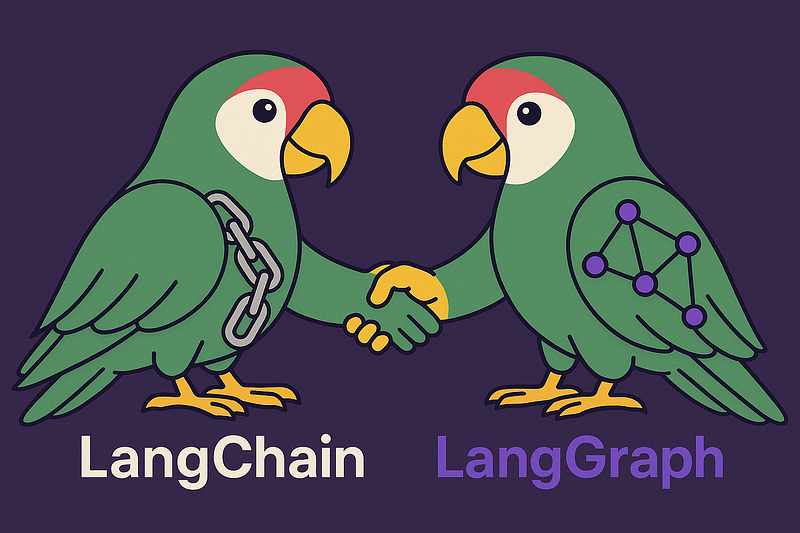
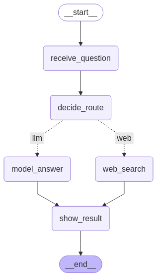

# LangChain + LangGraph na Prática: Criando Fluxos Inteligentes com LLMs

Este projeto demonstra como integrar **LangGraph** com **LangChain** para construir fluxos inteligentes e dinâmicos utilizando modelos de linguagem (LLMs). A proposta é mostrar na prática como essas ferramentas podem ser combinadas para criar sistemas de perguntas e respostas mais contextuais e interativos.

## 📌 Visão Geral

Neste exemplo, o fluxo segue os seguintes passos:

1. Recebe uma pergunta do usuário.
2. Decide se precisa buscar contexto na web ou responder diretamente com o LLM.
3. Executa a rota apropriada:
   - Se for uma pergunta sobre eventos atuais ou notícias, busca no **DuckDuckGo**.
   - Caso contrário, responde diretamente com o **LLM da Google (Gemini)**.
4. Exibe a resposta final ao usuário.

## ⚙️ Setup do Projeto

### 1. Clone o repositório

```bash
git clone https://github.com/seu-usuario/langchain_langgraph.git
cd langchain_langgraph
```

### 2. Configure a chave da API

Crie um arquivo config.yaml com sua chave da Google:

```bash
GOOGLE_API_KEY: "sua-chave-aqui"
```

## 🧠 Exemplo de Fluxo com LangGraph



Nodes:

- receive_question: Recebe e registra a pergunta.
- decide_route: Decide se deve buscar na web ou usar apenas o modelo.
- web_search: Usa DuckDuckGo para trazer contexto adicional.
- model_answer: Usa apenas o LLM para gerar uma resposta.
- show_result: Exibe a resposta final.
